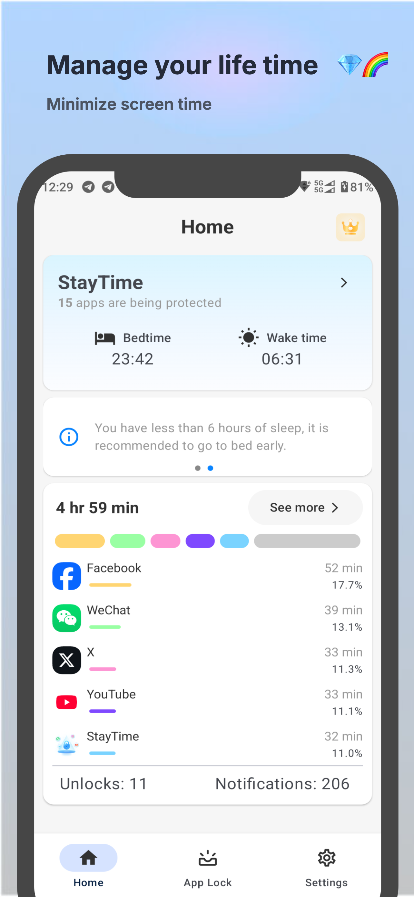
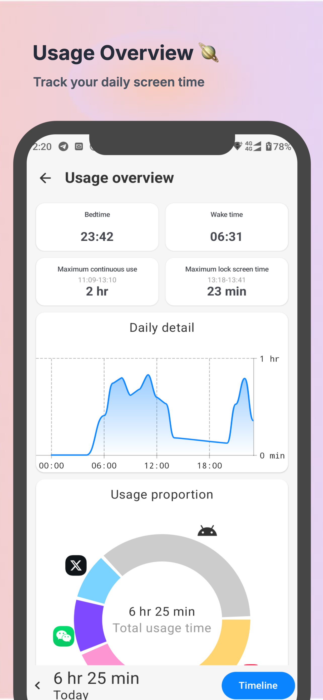
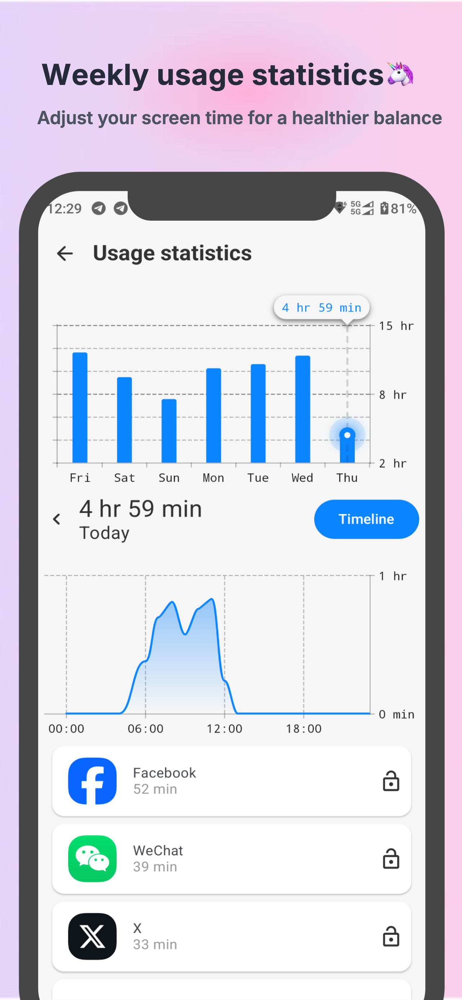
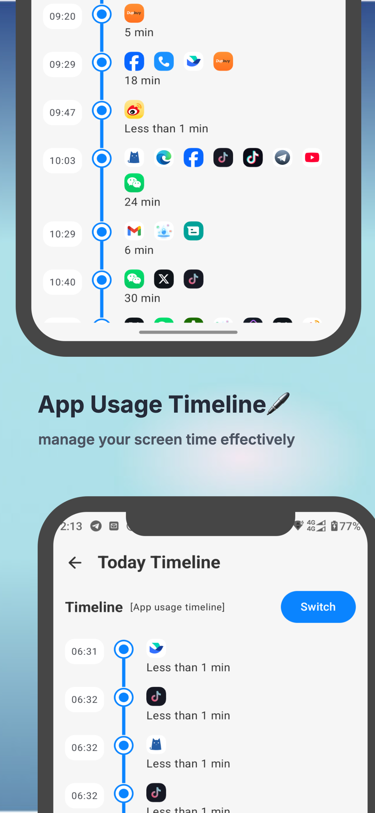
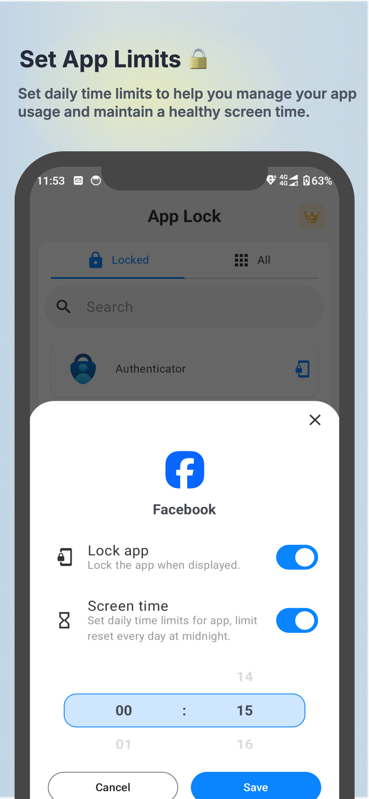

<head>
  <meta name="description" content="StayTime - App Lock and Screen Time Management. Block distracting apps, track usage, and stay productive.">
  <meta name="keywords" content="StayTime, App Lock, Screen Time, StayFree, Productivity, Digital Wellbeing, App Blocking, Usage Stats, Focus Mode, Sleep Mode, Device Usage, App Management, Time Management, Distraction Free, Android App, iOS App, Cross Platform, Usage Limits, Notifications, Alerts, Privacy Protection, Healthy Habits, Screen Time Tracking, App Usage, Digital Balance, Mobile Security">
  <meta name="author" content="StayTime Team">
</head>

  <a href="/" class="logo">StayTime</a>
  <nav class="main-nav">
    <a href="#features">App Blocking</a>
    <a href="#usage-stats">Usage Stats</a>
    <a href="#productivity">Productivity</a>
    <a href="#screenshots">Screenshots</a>
    <a href="#reviews">Reviews</a>
    <a href="#support">Support</a>
    <a href="https://play.google.com/store/apps/details?id=com.kapp.applocker" class="download-link">Download</a>
  </nav>

  

    <h1>Free yourself from over-use and distractions</h1>
    <h2>Stop wasting time!</h2>
    
Take control of your digital life. With StayTime you can <strong>block apps and websites</strong>, understand/visualize your <strong>device usage</strong>, and stay <strong>productive</strong>.

    

      
    

  

  

    
  

<section id="features" class="features">
  

    

      <h2>Block Distracting Apps</h2>
      
StayTime has your back.

      
Whether it's setting <strong>usage limits</strong>, settling into <strong>Focus Mode</strong>, managing notifications and alerts, or unwinding before bed with <strong>Sleep Mode</strong>, StayTime is your one-stop-shop for freeing up your valuable time and blocking apps that you find distracting.

    

    

      
    

  

  

    

      <h2>Understand Your Device Usage</h2>
      
Our powerful tracking features help you visualize usage stats across your device. Graphs help you understand your busiest periods throughout the day and cut down on usage when you should be focusing on other commitments.

      
For work and personal usage, StayTime takes screen time tracking to a whole new level.

    

    

      
    

  

  

    

      <h2>Focus On What's Important</h2>
      
Understanding and control leads to gains in <strong>productivity</strong>. Accomplish more during your days with StayTime and get back hours of wasted time.

      
Use <strong>Focus Mode</strong> to schedule time away from your phone. Create a space where you can be most productive.

    

    

      
    

  

</section>

<section id="screenshots" class="screenshots">
  <h2>App Screenshots</h2>
  

    

      
    

    

      
    

    

      
    

    

      
    

    

      
    

  

</section>

<section id="reviews" class="reviews">
  <h2>What Users Say</h2>
  

    

      

        
"It does what it says! I really like the fact that it works with apps and has a gentle reminder where you can add time. The app blocking features work flawlessly."

      

      

        
Emma H.

        
⭐⭐⭐⭐⭐

      

    

    

      

        
"This has been so helpful in limiting my screen time. It's easy to set the limits for how much time I want to spend on each app, and it gives me a warning when I'm nearing that limit."

      

      

        
Chris R.

        
⭐⭐⭐⭐⭐

      

    

    

      

        
"This app really helps people to know how much time is wasted on social media. The focus mode is a game-changer for productivity."

      

      

        
Alex S.

        
⭐⭐⭐⭐⭐

      

    

  

</section>

<section id="support" class="support">
  <h2>Need Help?</h2>
  
Read our online guide if you want to learn more about using StayTime. Or if you're having problems, feel free to contact our support team for assistance.

  

    <a href="#" class="support-button">Read User Guide</a>
    <a href="mailto:feedback@applockguard.com" class="support-button">Contact Support</a>
  

</section>

<footer class="site-footer">
  

    
StayTime

    

      <a href="#">Privacy Policy</a>
      <a href="#">Terms of Service</a>
      <a href="#">Contact</a>
    

    

      © 2024 StayTime. All rights reserved.
    

  

</footer> 